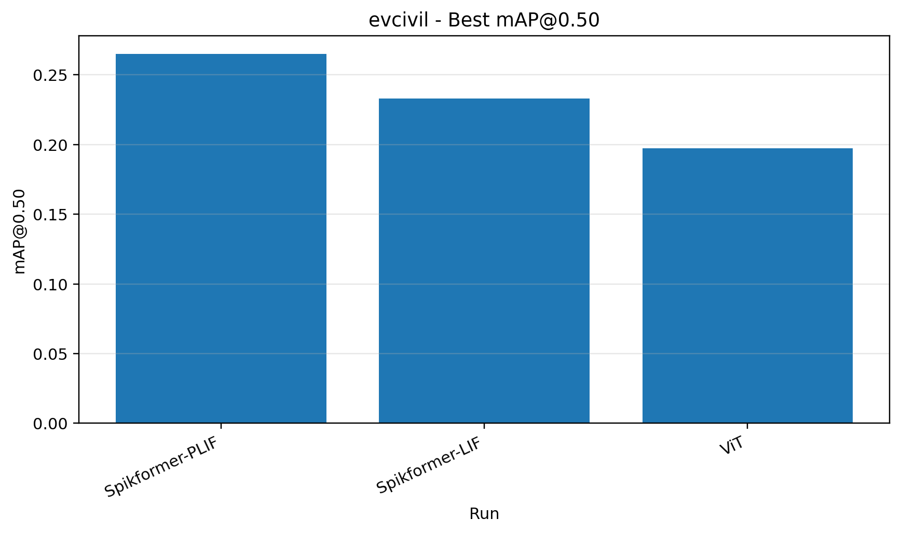
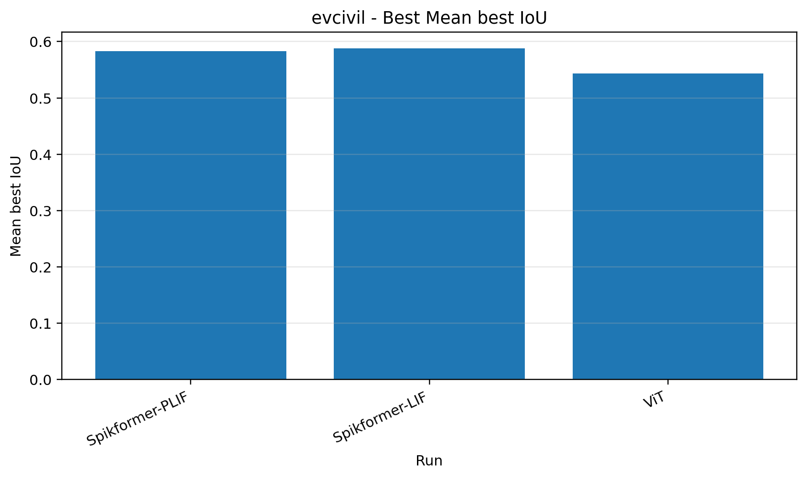
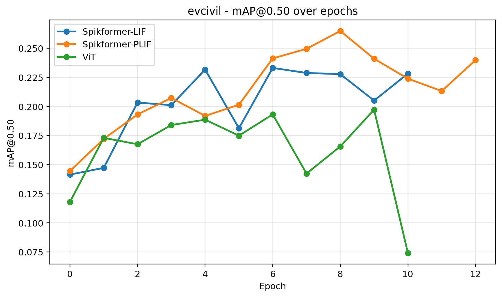

# Spik_CS338

This repository contains the implementation and experimental code used for the CS338 project. The codebase is based on the original Spikformer repository:

https://github.com/ZK-Zhou/spikformer

We adapted and reorganised the original implementation for our detection experiments, including several model variants and corresponding configuration files.

## Repository Structure

```text
Spik_CS338/
├── configs/              # Configuration files used for experiments
├── spikformer/           # Spikformer-based implementation
├── spikformer_plif/      # Spikformer variant with PLIF-related components
├── vit/                  # Vision Transformer baseline/variant
├── yolox/                # YOLOX-related detection modules
├── figs/                 # Figures generated from the current experimental results
├── requirements.txt      # Python dependencies used in this repository
└── README.md
```

## Installation

This repository provides a `requirements.txt` file that collects the dependencies used by the implemented variants. However, since this project is based on the original Spikformer codebase, we recommend first following the installation instructions from the original repository:

https://github.com/ZK-Zhou/spikformer

After setting up the main environment, install the additional dependencies in this repository:

```bash
pip install -r requirements.txt
```

If model checkpoints are tracked with Git LFS, install and pull Git LFS files after cloning:

```bash
git lfs install
git lfs pull
```

Please ensure that the installed PyTorch version is compatible with your CUDA version and GPU environment.

## Configuration

Before running experiments, update the corresponding files in the `configs/` directory. These configuration files define the experimental settings, including dataset paths, model settings, training parameters, and output/checkpoint locations.

The configuration files currently included in this repository correspond to the settings used to generate the figures reported in the `figs/` directory.

Typical items to check before running include:

* dataset root directory;
* train/validation split paths;
* checkpoint directory;
* batch size;
* number of epochs;
* learning rate;
* model-specific settings.

## Running Experiments

Each model variant has its own training and evaluation scripts. Please refer to the relevant folder and script for the variant you want to run:

```text
spikformer/
spikformer_plif/
vit/
```

Before running, make sure that:

1. the required dataset is available;
2. the paths in the corresponding config file are correct;
3. the Python environment has been properly installed;
4. any required checkpoints have been downloaded or pulled through Git LFS.

## Results

The current experimental results are provided in the `figs/` directory.

### Best mAP@50



### Mean Best IoU



### mAP@50 Training Curve



## Notes

* Large model weights and checkpoints should not be committed directly through standard Git. Use Git LFS when such files need to be versioned.
* Dataset folders are not included in this repository and should be prepared separately.
* The original Spikformer repository should be used as the primary reference for the base implementation and environment setup.
* The code in this repository has been reorganised for the experiments in this project, so some paths and configurations may differ from the upstream repository.

## Acknowledgement

This project is built upon the original Spikformer implementation by ZK-Zhou et al. We acknowledge the authors of the original repository for making their code publicly available.
